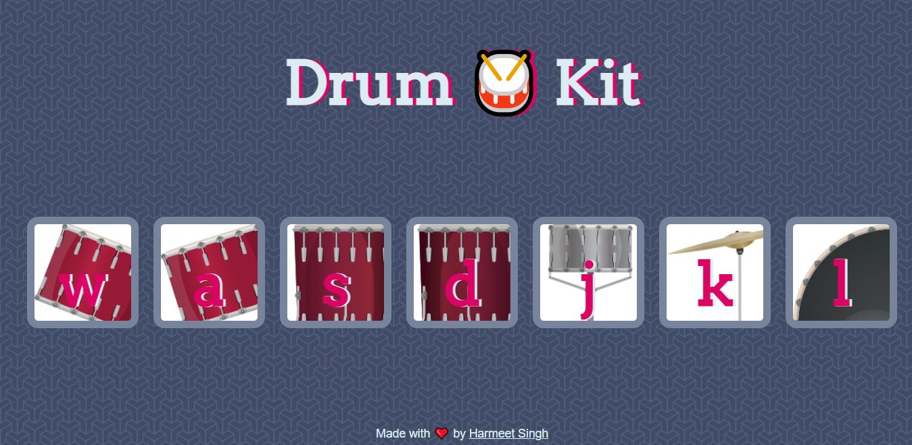

# Drum 🥁 Kit

A web based Drum music Kit which contains the number of keys that represents drums in a typical drum set. When the user clicks or presses the key, it plays corresponding sounds of the drum. This site was made for fun. So, enjoy playing.🎶🎶

## Demo

https://harmeetsingh11.github.io/drum-kit/

## Screenshots



## Run Locally

Clone the project

```bash
  git clone https://github.com/harmeetsingh11/drum-kit.git
```

Go to the project directory

```bash
  cd drum-kit
```

Start the project

```bash
  start index.html
```

## Tech Stack

- HTML5
- CSS3
- Vanilla Javascript

## Concepts Learned

- Advanced Javascript and DOM manipulation.
- Add Mouse, Keyboard Event listeners to Elements.

## Acknowledgements

I'd like to express my gratitude towards Dr. Angela Yu for her Web Development course at Udemy.
